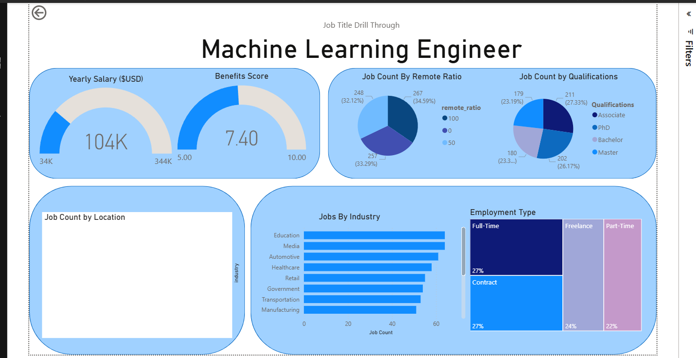
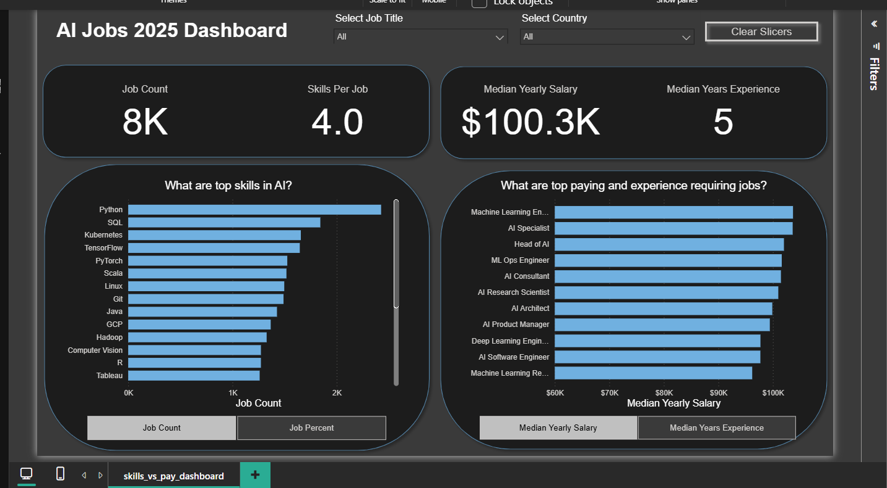

# 📊 AI Jobs Power BI Dashboards

This repository contains interactive **Power BI dashboards** analyzing the AI job market in 2025.  
The dashboards highlight job demand, compensation, skills, and experience requirements for AI-related roles.

---

## 🚀 Project Overview
The purpose of this project is to answer two key questions for **job seekers and professionals in AI**:

1. **What problem does this solve?**  
   Information on AI job roles is scattered across multiple platforms. This project centralizes insights about salaries, required skills, and job quality into one easy-to-use dashboard.

2. **Who is this for?**  
   - Students & job seekers exploring AI/data careers  
   - Professionals considering role transitions  
   - Recruiters and hiring managers analyzing skill trends  

---

## 📂 Repository Structure
- **`ai_job_dataset.csv`** → Dataset used to build the dashboards  
- **`dashboard_1_josh_project.pbix`** → Main AI Jobs Dashboard  
- **`dashboard_2_josh_project.pbix`** → Skills vs. Pay Dashboard  
- **`images/`** → Exported dashboard visualizations for quick preview  
- **`README.md`** → Documentation  

---

## 🖼️ Dashboard Visualizations

### **1️⃣ AI Jobs Dashboard 2025 (Overview Page)**
- Total Job Count: **8.2K**  
- Median Yearly Salary: **$100K**  
- Median Years of Experience: **5**  
- Job Trends (2024 → 2025)  
- Scatterplot: Experience vs. Salary  
- Highest Paying AI Jobs  

.png)

---

### **2️⃣ Drill-through Example (Machine Learning Engineer)**
- Salary: **$104K**  
- Benefits Score: **7.4/10**  
- Job Count by Remote Ratio & Qualifications  
- Jobs by Industry & Employment Type  
- Geographic Job Distribution  

---

### **3️⃣ Skills vs. Pay Dashboard**
- Top AI Skills (Python, SQL, TensorFlow, PyTorch, Kubernetes, etc.)  
- Average Skills per Job: **4.0**  
- Median Yearly Salary: **$100.3K**  
- Top Paying & Experience-Heavy Roles  

---

## 🔑 Key Insights
1. **Python dominates** – Python is the most demanded AI skill, followed by SQL, TensorFlow, and PyTorch.  
2. **Stable salaries** – Median compensation across AI roles is around **$100K** with ~5 years of experience.  
3. **Machine Learning Engineers lead** – They consistently top both job count and salary rankings.  
4. **Remote flexibility** – Around **⅓ of AI roles** allow remote work.  
5. **Skill stacking is critical** – On average, jobs list **4 skills per role**, often mixing programming, cloud, and ML frameworks.  

---

## ⚙️ Technical Details
- **Tool:** Microsoft Power BI  
- **Dataset:** Custom AI job dataset (`ai_job_dataset.csv`)  
- **Data Cleaning & Modeling:** Power Query  
- **Calculations:** DAX Measures (explicit measures, parameters)  
- **Visualizations:** Cards, Bar Charts, Line Graphs, Scatterplots, Matrix Tables, Drill-through Pages  

---

## 📌 How to Use
1. Clone/download this repository  
2. Open `.pbix` files in **Power BI Desktop**  
3. Interact with the dashboards:  
   - Use slicers for **Job Title** and **Country**  
   - Drill-through to analyze specific job roles  
   - Explore skill requirements, salary comparisons, and job quality  

---

## 🙌 Acknowledgements
This project demonstrates how **data analytics and visualization** can uncover valuable insights about the **AI job market**.  
Designed and developed end-to-end in **Power BI**.
